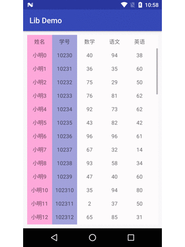

# BothwayListview
双向滚动的ListView

网上找到的代码，整理整理，方便使用。

#### 演示:



#### 使用：

##### Project build.gradle配置

```groovy
allprojects {
  repositories {
    ...
    maven { url 'https://jitpack.io' }
  }
}
```

##### Module build.gradel配置

```groovy
dependencies {
        implementation 'com.github.Dean1990:BothwayListview:-SNAPSHOT'
}
```

##### Demo:

[https://github.com/Dean1990/LibDemo](https://github.com/Dean1990/LibDemo)
